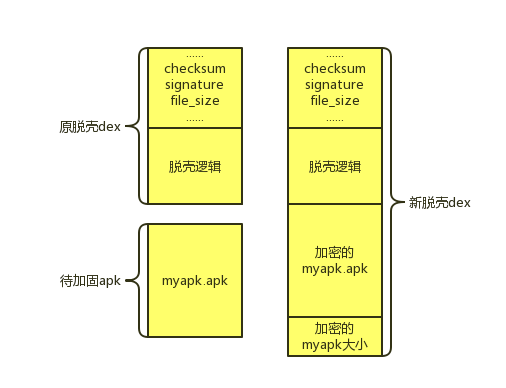

apk_dex_shell

一个演示如何给Apk加壳的示例代码.

 
apk加壳实例可以用上图来说明, 我们把要加固的myapk.apk放到一个dex尾部. 这个dex有脱壳逻辑, 程序运行时, 首先运行这个脱壳dex, 脱壳dex从dex尾部获取到要加密的apk的大小, 然后从自己的dex中拷贝出这个myapk.apk, 最后调用Android系统API运行myapk.apk. 这样就算用ApkTool等逆向工具, 也无法直接获得我们加固的myapk.apk. 为了增大逆向难度, 我们可以把脱壳逻辑用c实现放到so文件中, 同时把加密的myapk.apk分段放到so文件中. 为了防止特征破解, 我们可以改写apk魔数. 这样下来, 一个简单的加固工具就完成了.

这里提供一个demo, 只有最简单的把myapk.apk放到脱壳dex尾部的功能.

demo分为三个项目:

- DexReinforcingTools 
  - 给Apk加壳的工具, 可以用java或者cpp或者任何其他语言写成.
- MyApk 
  - 需要加固的Apk
- ShellingMyApk 
  - 脱壳Apk, 实际安装到用户手机上的是该Apk, 其在Application的 attachBaseContext 时会解压得到实际的apk文件, 然后运行实际的Apk.